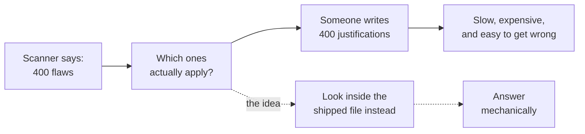
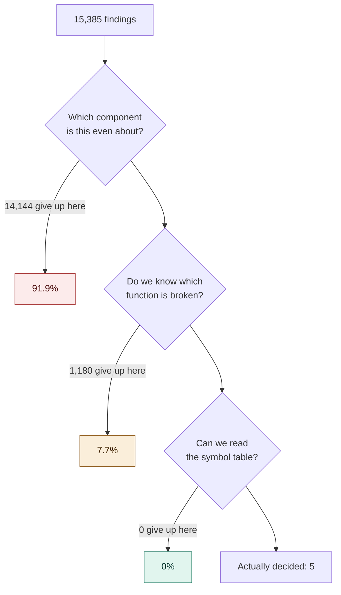
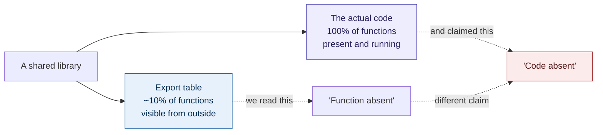

# LADING

**A tool that tried to prove vulnerabilities were absent from shipped software. It did not work. This repository is the measurement of how it failed, published in full.**

[](https://scorecard.dev/viewer/?uri=github.com/GautamTalksDev/Lading)
[](LICENSE)
[](RESULTS.md)
[](https://doi.org/10.5281/zenodo.22093232)

> **Status: archived.** Both pre registered kill tests resolved against the approach. The project stopped by its own rule. Nothing here is maintained, and you should not deploy it. The dataset, the paper and the two upstream bug reports are the output.

---

## Start here, whoever you are

**If you have never thought about this problem before,** read [The problem in plain language](#the-problem-in-plain-language) below. It takes two minutes and needs no background.

**If you want the result,** read [What we found](#what-we-found), then [RESULTS.md](RESULTS.md).

**If you are a researcher,** the paper source is in [`paper/`](paper/), the corpus catalogue and every decision the tool made are under [`corpus/`](corpus/), and the correction record is in [`audit/`](audit/).

**If you are here because you are building something similar,** read [FINDING-002](FINDING-002.md) and [FINDING-003](FINDING-003.md) first. They describe two ways this approach fails silently, and one of them will bite anyone who tries it.

---

## The problem in plain language

Modern software is assembled from thousands of pieces written by other people. Somebody publishes a list of known security flaws in those pieces. A scanner compares your product against that list and hands you a few hundred results.

Most of those results do not matter to you. The flawed feature was switched off at build time, or the code was never included, or your product does not use that part at all. But somebody still has to write down *why* each one does not matter, because regulators and customers now ask.

Under the EU Cyber Resilience Act this stopped being paperwork and became a deadline. If a flaw is genuinely unreachable in your product, the mandatory reporting clock does not start. If it is reachable, it does.

So the obvious idea: automate the check. Open the file that actually ships, look for the broken function, and answer yes or no.



That is the idea this repository tested. It does not work, and the interesting part is exactly where it stops working.

---

## What we found

Three results, in the order they were discovered. Each one corrected the one before it, and all three are published.

### 1. The tool almost never got far enough to look

Out of 15,385 scanner findings across 55 real artifacts, including twelve router and device firmware images pulled by hand, **99.6 percent stopped before any file was opened.**



The zero in the middle is the finding. Eighty three percent of the binaries in the corpus have had their symbol tables stripped out, and we had spent months designing around that. It never came up. The tool died much earlier, on the deeply unglamorous problem of working out that the name a Debian scanner uses and the name an advisory uses refer to the same project.

**Identity, not evidence, is the wall.** Until that is solved, the interesting question never gets asked.

### 2. When it did decide, it was wrong in a way that could not be detected

The tool cleared 35 findings. Every one of them said: the vulnerable function is not in the file, therefore you are safe.

The function really was absent. It was also absent from every copy of that library ever built anywhere, because it is internal and never exported. The check could not have returned any other answer.



Not merely wrong. **Unfalsifiable.** A rule that always says yes, reporting its output as evidence.

The tool did not catch this. Nothing in its design was capable of catching it. It took a person with `readelf` and an afternoon of suspicion.

### 3. Nobody ever checked whether the flaw applied at all

Found days later, after the second result was already written up.

Two of the four flaws in the manifest do not affect the software versions they were decided on. One of them targets a subsystem that did not exist in that release. So the answer was correct, arrived at by reasoning that had nothing to do with why it was correct.

Three layers had the same blind spot: the scanner reported them, the tool never compared versions, and the human verification asked whether the evidence held without asking whether the question applied.

**The fix we shipped for result 2 was aimed one layer too shallow.** It closed the symbol problem and left this one untouched. That is the most portable lesson here.

---

## The kill tests, and why they matter

Two thresholds were written into this README before a single line of the tool existed, and neither was ever moved.

| | Question | Bar | Outcome |
|---|---|---|---|
| **KT-1** | Can it decide at scale? | 30% of findings | **Not evaluable** |
| **KT-2** | Are its decisions sound? | Zero false clearances | **Fail** |

KT-1 is recorded as *not evaluable* rather than *fail*, and that distinction is deliberate. A fail would mean the idea was tested and lost. What happened is that the test never ran, because the pipeline stopped upstream of the question. Calling it a fail would claim a measurement that was never made.

KT-2's bar was one. Not a percentage. A single false clearance means the tool is unsound, because a false clearance does not save anyone time. It quietly removes a real vulnerability from somebody's radar and hands them a document saying it was checked.

Full reasoning, including the rule for when a kill test may be read at all, is in [RESULTS.md](RESULTS.md) and section 11 below.

---

## Two bugs found along the way

While assembling the test corpus we hit something unrelated and more immediately useful, in two widely used open source tools. Both are filed upstream with full reproductions.

| Finding | What happens | Filed |
|---|---|---|
| Source package attribution | Scan an image directly and get 409 flaws. Generate a bill of materials of the same image and scan that, same tool, same day, and get 137. No error, no warning, valid file. | [discussion #11139](https://github.com/aquasecurity/trivy/discussions/11139) |
| Format specific inventory loss | Ask for the same bill of materials in a different standard format and 151 packages become 1. Zero flaws reported. A clean bill of health from a complete and correct file. | [discussion #11140](https://github.com/aquasecurity/trivy/discussions/11140) |

The second matters more than it looks. A zero is indistinguishable from a genuinely clean product when you are looking at it from outside, and some organisations standardise on exactly that format for their regulatory paperwork.

Details in [FINDING-001.md](FINDING-001.md), prior art check in [FINDING-001-PRIOR-ART.md](FINDING-001-PRIOR-ART.md).

---

## What is actually in this repository

```
paper/          The paper. body.tex is the text; build lading-paper-acmart.tex
corpus/         Catalogue with hashes, every decision, evidence bundles,
                and the 100 statement hand labelled ground truth
audit/          Four read only audits. Two of them corrected published numbers
internal/       The engine. Archived, not maintained
manifest/       Curated flaw to function mappings. Contains known errors,
                deliberately preserved as evidence for FINDING-003
scripts/        rederive-results.sh regenerates every figure in the paper
docs/           Limits, evidence model, regulatory mapping
```

Start with [RESULTS.md](RESULTS.md) for the numbers, [FINDING-002.md](FINDING-002.md) and [FINDING-003.md](FINDING-003.md) for the two failure modes, and [`audit/`](audit/) if you want to see how the corrections were made.

---

## Reproducing this

Every figure in the paper regenerates from one script.

```bash
go build -o bin/lading ./cmd/lading
bash scripts/corpus-download.sh     # fetches artifacts from their original sources
bash scripts/corpus-scan.sh
bash scripts/rederive-results.sh
```

**One honest caveat.** We do not redistribute the scanned artifacts. The corpus contains proprietary vendor firmware and container images whose licences do not permit a third party to republish them. Instead the catalogue records a source URL and a SHA-256 for each, so you can fetch the same bytes from the original publisher and confirm they match what we measured.

This means reproduction depends on those sources staying up. Vendor download pages move and release archives get withdrawn. The hashes let you verify whatever you retrieve; they cannot guarantee you can retrieve it. We regard that as the honest trade against republishing material we have no right to republish.

---

## If you are building something like this

Four things worth knowing before you start, all of them learned the expensive way.

**Symbol absence proves less than it looks like it proves.** It is sound evidence only for functions that would appear in a reference build's export table. For internal functions, and internal functions are the majority, absence is guaranteed before your check runs.

**Check whether the flaw applies before you check anything else.** Version applicability is cheap and it is the first gate. We never built it and it cost us a third of a result.

**Identity resolution is not one problem solved once.** It appears to need separate work per packaging ecosystem. Our mapping table was Debian shaped, and on RPM based images it failed earlier and more completely.

**Ask the filesystem, do not assume the layout.** We measured the wrong library, then the wrong path pattern, then evidence from a second copy of a library at a different version on the same image. Three instances of one defect class, in a project whose entire premise was deterministic evidence.

---

## Section 11: the evaluability rule

Quoted verbatim, written at the first commit, never edited.

> **Kill test evaluability.** KT-1 tests whether at least 30 percent of scanner reported CVEs resolve to a decidable `not_affected` with a re derivable evidence bundle. If refusal stage attribution shows the instrument did not reach symbol table or evidence evaluation, that is zero symbol table refusals and at least 99 percent of findings terminating at identity resolution or manifest lookup, KT-1 is **not evaluable**, not fail; the measured decided rate must not be read as an answer to the pre registered question. Three consecutive not evaluable results on the same corpus after instrument passes intended to restore evaluability constitute a **pattern**; the pre registered action is **stop**.

Three consecutive not evaluable readings were recorded. The project stopped.

---

## Licence and citation

**Paper:** [10.5281/zenodo.22099794](https://doi.org/10.5281/zenodo.22099794)
**Dataset:** [10.5281/zenodo.22093232](https://doi.org/10.5281/zenodo.22093232)

Code under [Apache 2.0](LICENSE). Data and the hand labelled ground truth under CC BY 4.0. Contributions required a DCO sign off; see [CONTRIBUTING.md](CONTRIBUTING.md).

Product and project names referenced here belong to their respective owners and are used descriptively to identify the software measured. No affiliation or endorsement is implied.

Nothing in this repository is legal advice. It describes a regulatory context to motivate a technical problem, and it establishes nothing about whether any particular product satisfies any obligation. See [DISCLAIMER.md](DISCLAIMER.md).

**Corrections are welcome and will be published alongside the original.** That is not a courtesy. Two of the three results here exist because somebody went back and checked something that had already been written up.
